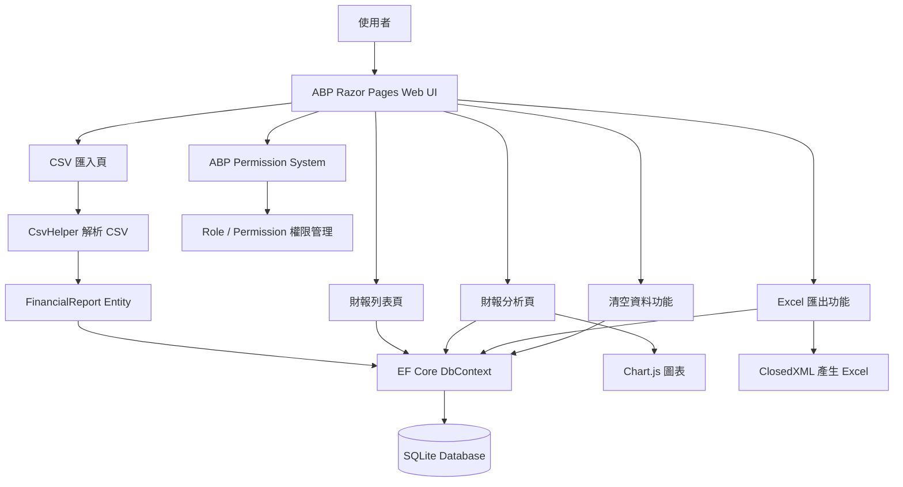

# AbpSolution2

## About this solution

This is a minimalist, non-layered startup solution with the ABP Framework. All the fundamental ABP modules are already installed. Check the [Application (Single Layer) Startup Template](https://abp.io/docs/latest/solution-templates/application-single-layer) documentation for more info.

### Pre-requirements

* [.NET10.0+ SDK](https://dotnet.microsoft.com/download/dotnet)
* [Node v18 or 20](https://nodejs.org/en)

### Configurations

The solution comes with a default configuration that works out of the box. However, you may consider to change the following configuration before running your solution:

* Check the `ConnectionStrings` in `appsettings.json` file under the `AbpSolution2` project and change it if you need.

### Solution structure

This is a single-layer application that consists of the following projects:

* `AbpSolution2`: ASP.NET Core MVC / Razor Pages application that contains all the application logic.

## Before running the application

### Generating a Signing Certificate

In the production environment, you need to use a production signing certificate. ABP Framework sets up signing and encryption certificates in your application and expects an `openiddict.pfx` file in your application.

This certificate is already generated when you created the solution, so most of the time you don't need to generate it yourself. However, if you need to generate a certificate, you can use the following command:

```bash
dotnet dev-certs https -v -ep openiddict.pfx -p a2db3231-a5f5-4a72-a9c2-571144bf7bf6
```

> `a2db3231-a5f5-4a72-a9c2-571144bf7bf6` is the password of the certificate, you can change it to any password you want.

It is recommended to use **two** RSA certificates, distinct from the certificate(s) used for HTTPS: one for encryption, one for signing.

For more information, please refer to: [OpenIddict Certificate Configuration](https://documentation.openiddict.com/configuration/encryption-and-signing-credentials.html#registering-a-certificate-recommended-for-production-ready-scenarios)

> Also, see the [Configuring OpenIddict](https://abp.io/docs/latest/Deployment/Configuring-OpenIddict#production-environment) documentation for more information.

### Install Client-Side libraries

Run the following command in your solution directory. This step is automatically done when you create a new solution, if you didn't especially disabled it. However, you should run it yourself if you have first cloned this solution from your source control, or added a new client-side package dependency to your solution.

```bash
abp install-libs
```

> This command installs all NPM packages for MVC/Razor Pages and Blazor Server UIs and this command is already run by the ABP CLI, so most of the time you don't need to run this command manually.

## Deploying the application

Deploying an ABP application follows the same process as deploying any .NET or ASP.NET Core application. However, there are important considerations to keep in mind. For detailed guidance, refer to ABP's [deployment documentation](https://abp.io/docs/latest/Deployment/Index).

### How to deploy on Docker

The application provides the related `Dockerfiles` and `docker-compose` file with scripts. You can build the docker images and run them using docker-compose. The necessary database, DbMigrator, and the application will be running on docker with health checks in an isolated docker network.

#### Creating the Docker images

Navigate to [etc/build](./etc/build) folder and run the `build-images-locally.ps1` script. You can examine the script to set **image tag** for your images. It is `latest` by default.

#### Running the Docker images using Docker-Compose

Navigate to [etc/docker](./etc/docker) folder and run the `run-docker.ps1` script. The script will generate developer certificates (if it doesn't exist already) with `dotnet dev-certs` command to use HTTPS. Then, the script runs the provided docker-compose file on detached mode.

> Not: Developer certificate is only valid for **localhost** domain. If you want to deploy to a real DNS in a production environment, use LetsEncrypt or similar tools.

#### Stopping the Docker containers

Navigate to [etc/docker](./etc/docker) folder and run the `stop-docker.ps1` script. The script stops and removes the running containers.

### Additional resources

You can see the following resources to learn more about your solution and the ABP Framework:

* [Application (Single Layer) Startup Template](https://abp.io/docs/latest/solution-templates/application-single-layer)

# ABP 財報 CSV 分析系統

## 一、專案簡介

本專案為使用 ABP Framework 建立之財報 CSV 匯入與分析系統。系統可匯入金融業財報 CSV 檔案，將公司財務資料儲存至 SQLite 資料庫，並提供財報列表、財報分析、圖表視覺化、Excel 匯出、清空資料與 ABP 權限控管功能。

本系統主要用於示範企業級後台系統的基本開發流程，包含資料匯入、資料庫保存、資料分析、資料匯出、角色權限管理與導覽選單整合。

---

## 二、使用技術

- 後端框架：ABP Framework
- Web 技術：ASP.NET Core Razor Pages
- 資料庫：SQLite
- ORM：Entity Framework Core
- CSV 解析：CsvHelper
- Excel 匯出：ClosedXML
- 圖表工具：Chart.js
- 權限管理：ABP Permission System
- 開發工具：Visual Studio / ABP Studio / PowerShell

---

## 三、系統功能

### 1. 財報 CSV 匯入

使用者可透過「匯入 CSV」頁面上傳財報 CSV 檔案，系統會解析 CSV 欄位，並將資料轉換為 FinancialReport Entity 後寫入 SQLite 資料庫。

### 2. 財報資料列表

系統提供財報列表頁面，可查看年度、季別、公司代號、公司名稱、資產總計、負債總計、權益總計、負債比與每股參考淨值。

### 3. 財報分析

系統會根據已匯入的財報資料，自動產生分析結果，包含：

- 公司總數
- 資產最高公司
- 負債比最高公司
- 每股參考淨值最高公司
- 資產總計 Top 5
- 負債比 Top 5
- 每股參考淨值 Top 5

### 4. Chart.js 圖表視覺化

財報分析頁使用 Chart.js 將 Top 5 排行資料轉換為長條圖，方便使用者快速比較不同公司財務狀況。

### 5. Excel 匯出

系統可將目前資料庫中的財報資料匯出為 Excel 檔案，檔名為：

```text
FinancialReports.xlsx
```

### 6. 清空資料

系統提供清空資料功能，可刪除目前資料庫中的所有財報資料，方便重新匯入 CSV 進行測試或展示。

### 7. ABP 權限控管

系統整合 ABP Permission System，建立以下權限：

```text
FinancialReports
FinancialReports.Import
FinancialReports.Export
FinancialReports.Delete
FinancialReports.Analysis
```

管理者可透過 ABP 後台角色管理功能，決定不同角色是否可以使用財報列表、匯入、匯出、清空資料與分析功能。

---

## 四、系統架構圖



---

## 五、資料表設計

主要資料表：

```text
AppFinancialReports
```

主要欄位如下：

| 欄位 | 說明 |
|---|---|
| Year | 年度 |
| Quarter | 季別 |
| CompanyCode | 公司代號 |
| CompanyName | 公司名稱 |
| TotalAssets | 資產總計 |
| TotalLiabilities | 負債總計 |
| TotalEquity | 權益總計 |
| NetWorthPerShare | 每股參考淨值 |
| RawJson | 原始 CSV 資料 |

---

## 六、主要頁面

| 頁面 | 路徑 | 說明 |
|---|---|---|
| 財報列表 | `/FinancialReports` | 顯示所有已匯入財報資料 |
| 匯入 CSV | `/FinancialReports/Import` | 上傳並匯入 CSV 檔案 |
| 財報分析 | `/FinancialReports/Analysis` | 顯示排行榜與 Chart.js 圖表 |
| 匯出 Excel | `/FinancialReports?handler=Export` | 匯出財報資料為 Excel |
| 清空資料 | `/FinancialReports` | 透過表單送出清空資料指令 |

---

## 七、執行方式

### 1. 進入專案資料夾

```bash
cd AbpSolution2
```

### 2. 還原 NuGet 套件

```bash
dotnet restore
```

### 3. 建立或更新資料庫

```bash
dotnet ef database update
```

### 4. 啟動系統

```bash
dotnet run
```

### 5. 開啟網站

```text
https://localhost:44353
```

實際網址與 port 請以 PowerShell 顯示的 `Now listening on` 為準。

---

## 八、操作流程

1. 啟動 ABP 系統。
2. 使用管理員帳號登入。
3. 進入「Administration → Identity Management → Roles → admin → Permissions」。
4. 勾選 FinancialReports 相關權限。
5. 開啟「財報系統」選單。
6. 點選「匯入 CSV」並上傳財報 CSV。
7. 回到「財報列表」確認資料。
8. 點選「財報分析」查看 Top 5 排行與圖表。
9. 點選「匯出 Excel」下載財報資料。
10. 需要重新測試時，可點選「清空資料」後再次匯入。

---

## 九、注意事項

上傳 GitHub 時，請勿上傳以下檔案或資料夾：

```text
.vs/
bin/
obj/
*.db
*.db-shm
*.db-wal
node_modules/
wwwroot/libs/
*.user
*.suo
```

SQLite 資料庫檔案不建議直接上傳，資料庫可透過 EF Core Migration 重新建立。

---

## 十、專案特色

本系統不只是單純顯示 CSV 資料，而是將 CSV 匯入、資料庫儲存、資料分析、圖表視覺化、Excel 匯出與權限控管整合成完整後台系統。透過 ABP Framework 的導覽選單與權限機制，可模擬實際企業後台系統的資料管理流程。