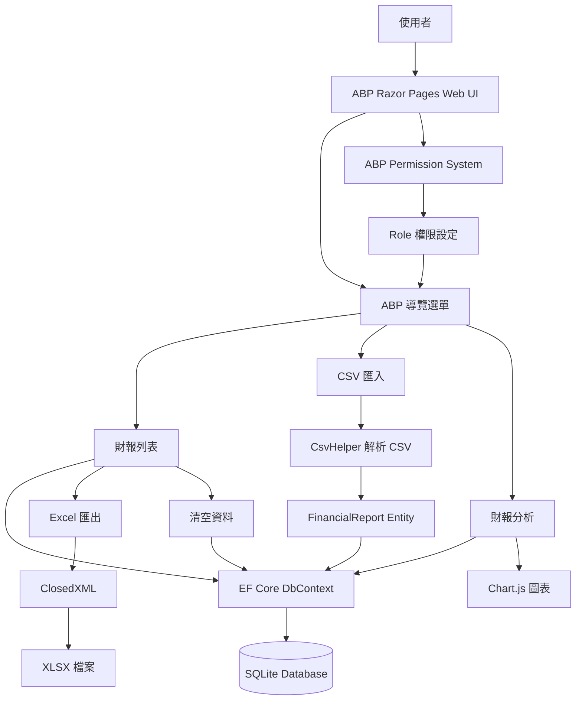

# 系統架構圖

本系統採用 ABP Framework + ASP.NET Core Razor Pages 架構，並透過 SQLite 儲存財報資料。使用者可透過 Web UI 匯入 CSV、查看財報列表、進行財報分析、匯出 Excel，並由 ABP 權限系統控管不同角色可使用的功能。

## 架構說明

### 1. 使用者介面層

使用 ABP Razor Pages 建立財報系統頁面，包含財報列表、CSV 匯入、財報分析等功能。

### 2. 資料處理層

CSV 匯入功能使用 CsvHelper 解析財報資料，並將資料轉換為 FinancialReport Entity。

### 3. 資料存取層

系統透過 Entity Framework Core DbContext 與 SQLite 資料庫互動，完成新增、查詢、刪除與匯出資料。

### 4. 分析與視覺化層

財報分析頁會計算資產總計、負債比與每股參考淨值排行榜，並使用 Chart.js 顯示圖表。

### 5. 匯出功能

系統使用 ClosedXML 將財報資料產生為 Excel 檔案，提供使用者下載。

### 6. 權限控管層

系統整合 ABP Permission System，透過角色權限控管財報列表、匯入、匯出、清空資料與財報分析功能。